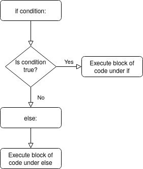
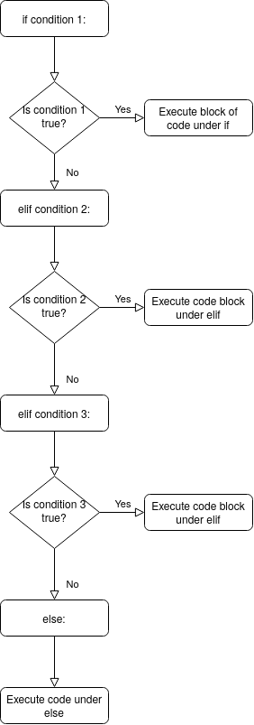

# If Statement

<!--- Make a flow chart to illustrate the control flow!-->
The `if` statement is used to execute a block of code if a condition is true. The syntax of an if statement is:
```
if condition:
    block of code
```
where `condition` must be/evaluate to a boolean value. If `condition` evaluates to `True` then control moves to the block of code indented after the `:` and it is executed. <!--- Is this language correct?--> If `condition` evaluates to `False`, then the block of code is skipped and control moves on to the code after the `if` statement.


### Worked Example

Let's consider the case where we want to check if one variable is greater than the other:


<div markdown="1" class="cell code_cell">
<div class="input_area" markdown="1">
```python
a = 3
b = 2

if a > b:
    print(a, 'is greater than', b)

```
</div>

<div class="output_wrapper" markdown="1">
<div class="output_subarea" markdown="1">
{:.output_stream}
```
3 is greater than 2
```
</div>
</div>
</div>


If we ran the code above but with
```
a = 2
b = 2
```
then we would see nothing printed out.


## Else

What if you wanted to execute a code block if a statement is true; and another if it's false. The `else` part of an if statement can be used for this:
```
if condition:
    code block 1
else:
    code block 2
```
If `condition` evaluates to `True` then `code block 1` will be executed. If, on the other hand, `condition` evaluates to `False`, `code block 2` will be executed.

 <!--- Figure caption?-->


### Worked Example

Let's take our first example and add an `else` part to it:


<div markdown="1" class="cell code_cell">
<div class="input_area" markdown="1">
```python
a = 3
b = 2

if a > b:
    print(a, 'is greater than', b)
else:
    print(a, 'is less than or equal to', b)

```
</div>

<div class="output_wrapper" markdown="1">
<div class="output_subarea" markdown="1">
{:.output_stream}
```
3 is greater than 2
```
</div>
</div>
</div>


<div markdown="1" class="cell code_cell">
<div class="input_area" markdown="1">
```python
a = 1
b = 2

if a > b:
    print(a, 'is greater than', b)
else:
    print(a, 'is less than or equal to', b)

```
</div>

<div class="output_wrapper" markdown="1">
<div class="output_subarea" markdown="1">
{:.output_stream}
```
1 is less than or equal to 2
```
</div>
</div>
</div>


## Elif

Now, what if you have more than 2 mutually/partially exclusive conditions? You could try multiple `if` statements:
```
if condition_1:
    code block 1
if (not condition_1) and condition_2:
    code block 2
if (not condition_1) and (not condition_2) and condition_3:
    code block 3
```
but not only is this annoying to write, it is computationally expensive. If one of these conditions is true, then the others aren't, but the computer will still check each condition in turn.

Another attempt could be to embed the if statements:
```
if condition_1:
    code block 1
else:
    if condition_2:
        code block 2
    else:
        if condition_3:
            code block 3
```

this is better in terms of computational costs, but is messy and confusing. Luckily Python gives us a tool for this problem, the `elif` part of the `if` statement:
```
if condition_1:
    code block 1
elif condition_2:
    code block 2
elif condition_3:
    code block 3
```
The computer first checks `condition_1`. If `condition_1` evaluates `True` then `code block 1` is executed and control moves leaves the if statement. If `condition_1` evaluates as `False` then the computer will check `condition_2`, if this evaluates as `True` then `code block 2` will be executed and control will leave the if statement. If both `condition_1` and `condition_2` are both `False`, then the computer will check `condition_3`, if this evaluates to `True` `code block 3` will be executed and control will leave the if statement. <!--- mention case where all through are false--> <!--- try to cut down this explanation-->
<!--- show flow chart for this?-->


For example, lets write a script that checks if a variable is a multiple of 2, 3, or 5.


<div markdown="1" class="cell code_cell">
<div class="input_area" markdown="1">
```python
var = 4

if var % 2 == 0:
    print('Variable is a multiple of 2')
elif var % 3 == 0:
    print('Variable is a multiple of 3')
elif var % 5 == 0:
    print('Variable is a multiple of 5')

```
</div>

<div class="output_wrapper" markdown="1">
<div class="output_subarea" markdown="1">
{:.output_stream}
```
Variable is a multiple of 2
```
</div>
</div>
</div>


<div markdown="1" class="cell code_cell">
<div class="input_area" markdown="1">
```python
var = 21

if var % 2 == 0:
    print('Variable is a multiple of 2')
elif var % 3 == 0:
    print('Variable is a multiple of 3')
elif var % 5 == 0:
    print('Variable is a multiple of 5')

```
</div>

<div class="output_wrapper" markdown="1">
<div class="output_subarea" markdown="1">
{:.output_stream}
```
Variable is a multiple of 3
```
</div>
</div>
</div>


<div markdown="1" class="cell code_cell">
<div class="input_area" markdown="1">
```python
var = 25

if var % 2 == 0:
    print('Variable is a multiple of 2')
elif var % 3 == 0:
    print('Variable is a multiple of 3')
elif var % 5 == 0:
    print('Variable is a multiple of 5')

```
</div>

<div class="output_wrapper" markdown="1">
<div class="output_subarea" markdown="1">
{:.output_stream}
```
Variable is a multiple of 5
```
</div>
</div>
</div>


<div markdown="1" class="cell code_cell">
<div class="input_area" markdown="1">
```python
var = 6

if var % 2 == 0:
    print('Variable is a multiple of 2')
elif var % 3 == 0:
    print('Variable is a multiple of 3')
elif var % 5 == 0:
    print('Variable is a multiple of 5')

```
</div>

<div class="output_wrapper" markdown="1">
<div class="output_subarea" markdown="1">
{:.output_stream}
```
Variable is a multiple of 2
```
</div>
</div>
</div>


Note that even though 6 is a multiple of both 2 and 3, because 2 appears above 3 in the `if` statement that's the message we see.


<div markdown="1" class="cell code_cell">
<div class="input_area" markdown="1">
```python
var = 7

if var % 2 == 0:
    print('Variable is a multiple of 2')
elif var % 3 == 0:
    print('Variable is a multiple of 3')
elif var % 5 == 0:
    print('Variable is a multiple of 5')

```
</div>

</div>


Note that 7 is not a multiple 2, 3 or 5 and thus all of the `if` and `elif` conditions are false.


### Else and Elif

If you include an `else` part of an `if` statement with `elif` parts, the code block in the `else` statement only executes if all of the conditions in the `if` and `elif` statements that precede it are false.



As an example of this let's go back to our original example:


<div markdown="1" class="cell code_cell">
<div class="input_area" markdown="1">
```python
a = 3
b = 2

if a > b:
    print(a, 'is greater than', b)
elif a < b:
    print(a, 'is less than', b)
else:
    print(a, 'is equal to', b)

```
</div>

<div class="output_wrapper" markdown="1">
<div class="output_subarea" markdown="1">
{:.output_stream}
```
3 is greater than 2
```
</div>
</div>
</div>


<div markdown="1" class="cell code_cell">
<div class="input_area" markdown="1">
```python
a = 1
b = 2

if a > b:
    print(a, 'is greater than', b)
elif a < b:
    print(a, 'is less than', b)
else:
    print(a, 'is equal to', b)

```
</div>

<div class="output_wrapper" markdown="1">
<div class="output_subarea" markdown="1">
{:.output_stream}
```
1 is less than 2
```
</div>
</div>
</div>


<div markdown="1" class="cell code_cell">
<div class="input_area" markdown="1">
```python
a = 2
b = 2

if a > b:
    print(a, 'is greater than', b)
elif a < b:
    print(a, 'is less than', b)
else:
    print(a, 'is equal to', b)

```
</div>

<div class="output_wrapper" markdown="1">
<div class="output_subarea" markdown="1">
{:.output_stream}
```
2 is equal to 2
```
</div>
</div>
</div>

